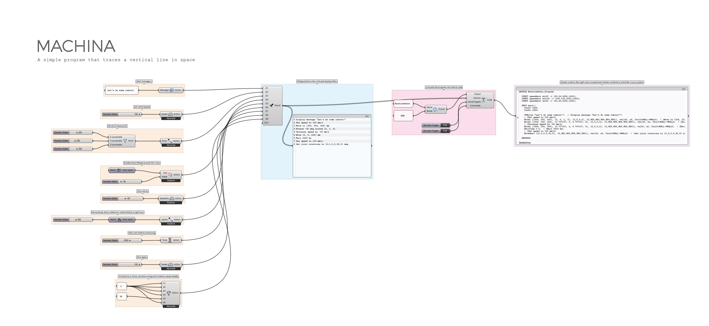

# Machina for Grasshopper

Thanks for downloading Machina for Grasshopper, a [Machina](https://github.com/garciadelcastillo/Machina)-based [Grasshopper](http://www.grasshopper3d.com/) package for robot control.

## Installation (Expert)
Download the [latest release](https://github.com/garciadelcastillo/Machina-Grasshopper/releases). Just as with any other Grasshopper plugin, just drop the main .gha and .dll files in Grasshopper's Components library. Make sure to right-click on both files and unblock them if necessary. Also, if running Windows 10, make sure you have extracted the files from the .zip file with something other than Window's native extracter, such as [7Zip](http://www.7-zip.org/), [WinRAR](https://www.rarlab.com/) or similar (see below for reasons).

## Installation (Beginner)
In order to install Machina for Grasshopper, you need to follow the following steps.

- Go to the [releases](https://github.com/garciadelcastillo/Machina-Grasshopper/releases) section and download the latest version of the distributable.

- Extract the contents of the `MachinaGrasshopper_vX.X.X.zip` file somewhere in your computer: if you are running Windows 10, make sure extract the files from the .zip file with something other than Window's native shell extracter (the one you use when double clicking on the file or right-clicking and choosing `Extract`), such as [7Zip](http://www.7-zip.org/), [WinRAR](https://www.rarlab.com/) or similar. Failure to do so may cause Window's security settings to internally flag the .dll file as downloaded-from-internet-suspicious, and block it forever.

- Paste these files in Grasshopper's Components folder: open Rhino and Grasshopper, and in GH, go to `File > Special Fodlers > Components Folder`. This should open a Windows Explorer window in a folder of the kind `C:\Users\yourUsername\AppData\Roaming\Grasshopper\Libraries`. Once in this folder, paste the previously extracted .gha and .dll files there. You are welcome to also paste the sample files there as well, or keep them somewhere for your reference.

- Unblock the files: in your Components folder, right click on Machina's .gha and .dll files, choose `Properties`, and make sure they are unblocked in the lower right end of the popup menu.

- Restart both Grasshopper and Rhino for the changes to take effect.

## Tutorials
There are a bunch of Grasshopper files in the `samples` folder that comes with this package. These files will help you understand how to setup a Machina project. I will write a dedicated walkthrough section sometime soon...

A full set of tutorials on how to use the Machina framework can be found here:

Tutorials playlist: https://www.youtube.com/playlist?list=PLvxxYImPCApXj3tHVKmpTS_AuMPngnA47

Instructions on how to setup your machine to work with the Machina framework can be found here: https://www.youtube.com/playlist?list=PLvxxYImPCApUffcv_KtdR-sQydA4O4CPH.

## Projects

A playlist of projects built by the community with different Machina flavors:
https://www.youtube.com/playlist?list=PLvxxYImPCApXZ-yBCUtGzVWb2ZhduaSXR

🤖x❤️

Machina for Grasshopper is built on top of [__Machina__](https://github.com/garciadelcastillo/Machina), an open-source platform for action-based control of mechanical actuators.

Machina is also available for [Autodesk's Dynamo](https://github.com/garciadelcastillo/Machina-Dynamo). Their API and Actions list is 99% identical.

Here are some videos of things you can do with Machina:
- [Surface Milling](https://youtu.be/054s9XlslVs)
- [Metal Forming](https://youtu.be/_6Bbm7Scs4w)

## Disclaimer
__Working with robots is dangerous.__ Robotic actuators are very powerful machines, but for the most part extremely unaware of their environment; if it collides with something, including yourself, it will not detect it and try to keep going, posing a threat to itself and the operators surrounding it. This is particularly relevant when running in 'automatic' mode, where several security measures are bypassed for the sake of performance.

When using robots in a real-time interactive environment, please make sure:
- You have been __adequately trained__ to use that particular machine,
- you are in __good physical and mental condition__,
- you are operating the robot under the __utmost security measures__,
- you are following the facility's and facility staff's __security protocols__,
- and the robot has the __appropriate guarding__ in place, including, but not reduced to, e-stops, physical barriers, light curtains, etc.

__Machina is in a very early stage of development.__ You are using this software at your own risk, no warranties are provided herewith, and unexpected results/bugs may arise during its use. Always test and simulate your applications thoroughly before running them on a real device. The author/s shall not be liable for any injuries, damages or losses consequence of using this software in any way whatsoever.

## Contribute
Want to help develop/document Machina for Grasshopper? Get in touch! :)

## Acknowledgments
The development of Machina was sponsored by [Autodesk, Inc](https://www.autodesk.com/), as part of a summer research residency project in Boston, 2016. Please take a look at the [detailed list of acknowledgments](https://github.com/garciadelcastillo/Machina/blob/master/Docs/Acknowledgments.md)

Machina was created and is maintained by [Jose Luis Garcia del Castillo](http://www.garciadelcastillo.es).

## License
[MIT License](https://github.com/garciadelcastillo/Machina-Grasshopper/blob/master/LICENSE.md)

